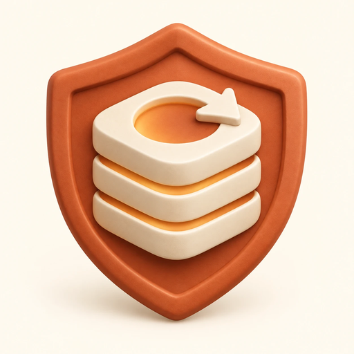

<p align="center"></p>

# cachekeeper

[English](README.md) · **한국어**

**살아 있는 프롬프트 캐시를 실수로 버리지 않게 해 주는 Claude Code 플러그인입니다.** 다음 세 가지 핵심 기능으로 구성되어 있습니다.

- 🛡️ **모델 전환 가드**: `/model`이나 모델 선택기로 캐시가 살아 있는 세션의 모델을 바꾸려 할 때, 손실될 사용량과 캐시를 지키는 대안을 먼저 안내하고 확인을 구합니다.
- ⚡ **스마트 Keep-Alive (기본 활성화)**: 자리를 비운 동안 55분마다 짧은 핑을 보내 긴 세션의 캐시를 살려 둡니다. 사용자의 실제 사용 기록상 다시 구축하는 것보다 비용이 저렴한 기간까지만 유지합니다.
- 📊 **대화 감사 (`cachekeeper audit`)**: 내 대화 기록으로 Keep-Alive와 가드가 사용량을 몇 % 줄이는지(절감률) 보여 줍니다. 캐시 재구축도 원인별로 분류하여 어떤 사용 습관이 가장 큰 비용을 발생시키는지 진단합니다.

---

## 목차
- [빠른 설치](#설치)
- [기본 사용법](#사용법)
- [기대 효과](#기대-효과)
- [장점](#장점)
- [설정 (환경 변수)](#요구-사항과-설정)
- [라이선스](#라이선스)
---
- 📖 **상세 기술 문서 (클릭하여 펼치기)**
  - [🪟 Windows 환경 설정 가이드](#windows-환경-설정-가이드)
  - [📊 왜 필요한가 & 제작자 12.7일 실측 데이터](#왜-필요한가-실측-데이터)
  - [⚖️ 두 가지 과금 잣대 (구독 vs API)](#두-가지-과금-잣대)
  - [🛡️ 모델 전환 가드 상세 & 서브에이전트 위임](#모델-전환-가드-상세)
  - [⚡ Keep-Alive 상세 & 터미널 상태 표시줄 설정](#keep-alive-상세)
  - [🔄 세션을 얼마나 키울 것인가 (자동 압축 시뮬레이션)](#세션을-얼마나-키울-것인가)
  - [🔍 다른 13개 Keep-Alive 프로젝트와의 상세 비교](#다른-keep-alive-도구와의-비교)
  - [❓ 자주 묻는 질문 (Q&A 11종)](#자주-묻는-질문-qa)
  - [⚠️ 한계 및 제약 사항](#한계)
  - [🧪 테스트 및 CI 검증 방식](#테스트)

---

## 설치

> [!NOTE]
> Claude Code(v2.1.280 이상)와 Python 3.8 이상이 필요합니다. Windows 사용자는 아래 접힌 가이드를 참고하세요.

### 터미널에서 설치
```bash
claude plugin marketplace add grapefruit0205/cachekeeper
claude plugin install cachekeeper@cachekeeper
```

### Claude Code 내부에서 설치
```text
/plugin marketplace add grapefruit0205/cachekeeper
/plugin install cachekeeper@cachekeeper
```

별도의 설정 없이 즉시 동작합니다. (데스크톱 앱: 열린 세션 즉시 적용 / 터미널: 재시작 필요)
- **업데이트**: `claude plugin marketplace update cachekeeper` 실행 후 `claude plugin update cachekeeper@cachekeeper`
- **삭제**: `claude plugin uninstall cachekeeper@cachekeeper`

<details id="windows-환경-설정-가이드">
<summary><b>🪟 [자세히 보기] Windows 환경 설정 가이드 (Git Bash / PowerShell / MSIX)</b></summary>

Claude Code는 Windows에서 플러그인 Hook을 **Git Bash**로 실행하고, Git Bash가 없으면 **PowerShell**로 실행합니다. cachekeeper의 Hook은 0.9.0부터 둘 다에서 실행됩니다. Claude 데스크톱 앱과 터미널의 Claude Code 모두 같습니다. 필요한 것은 Python입니다.

1. **Python 3.8 이상 설치**: [python.org](https://www.python.org/downloads/windows/)에서 설치합니다. PowerShell에서 `python3 --version`, `python --version`, `py -3 --version` 중 하나가 3.8 이상을 출력하면 됩니다. Windows에 기본으로 들어 있는 `python`은 Microsoft Store로 안내하는 바로가기일 뿐 Python이 아닙니다.
2. **Claude 데스크톱 앱이나 터미널을 완전히 종료했다가 다시 엽니다** (데스크톱 앱은 트레이 아이콘에서도 종료). 이미 실행 중인 Claude Code는 설치 전의 환경을 그대로 쓰기 때문입니다.
3. **설치 확인**: 새 세션에서 `/cachekeeper:audit`를 실행합니다. 리포트가 나오면 Python을 찾은 것이고, Hook도 같은 Python으로 실행됩니다. `Python 3.8 or newer is required`가 나오면 1번을 다시 확인하세요. Python이 없으면 Hook은 오류 없이 조용히 꺼져 있으므로 이 확인이 필요합니다.

Git for Windows는 없어도 됩니다. 설치되어 있으면 Claude Code가 그 Git Bash로 Hook을 실행하며, `C:\Program Files\Git`이나 PATH에 있는 `git` 옆에서 찾습니다. 다른 곳에 설치했다면 `~/.claude/settings.json`에 경로를 지정합니다.

```json
{
  "env": {
    "CLAUDE_CODE_GIT_BASH_PATH": "C:\\Program Files\\Git\\bin\\bash.exe"
  }
}
```

Git Bash가 없으면 PowerShell 7(`pwsh`)이 설치되어 있을 경우 그것으로, 없으면 Windows 기본 Windows PowerShell 5.1로 실행됩니다. 이때 `/cachekeeper:audit`는 `bin/cachekeeper.ps1`을 경로로 직접 실행합니다 (Claude Code는 플러그인의 `bin/`을 Bash 도구의 PATH에만 넣기 때문입니다).

- **WSL 환경**: WSL에서 실행하는 Claude Code(데스크톱 앱의 WSL 환경 포함)는 Linux와 동일합니다. cachekeeper를 WSL 안의 Claude Code에 설치하면 되며, Python은 WSL의 Ubuntu에 기본 내장되어 있습니다.
- **환경 테스트 현황**: 제작자는 Ubuntu에서 사용합니다. Windows는 CI(GitHub Windows 러너의 Git Bash, PowerShell 7, Windows PowerShell 5.1)로 테스트를 마쳤으며, 실제 Windows 물리 기기에서는 아직 확인하지 못했습니다.

> [!NOTE]
> MSIX 패키지로 설치된 Windows 데스크톱 앱에는, 앱이 자체 폴더(`%APPDATA%\Claude`)에 풀어 둔 플러그인 파일을 Git Bash나 Python 같은 외부 프로그램이 읽지 못하는 버그가 있습니다([anthropics/claude-code#96087](https://github.com/anthropics/claude-code/issues/96087)). 마켓플레이스에서 설치한 cachekeeper는 보통 `C:\Users\<이름>\.claude\plugins`에 저장되므로 해당되지 않을 것으로 보이지만, 확인되지는 않았습니다. 해당되더라도 Hook은 파일을 찾지 못하면 조용히 종료되므로(Keep-Alive 핑일 때만 exit 2 반환) 무한 루프는 발생하지 않으며 가드와 Keep-Alive만 동작하지 않습니다.

</details>

---

## 사용법

평소에는 별도로 명령어를 실행할 필요 없이 세 가지 기능이 자동으로 동작합니다.

1. **모델을 변경할 때 (가드 동작)**: 캐시가 살아 있는 상태에서 재구축 비용이 **$1 이상**이면 전환을 잠시 멈추고 안내합니다.
   - **이 작업만 새 모델에 맡기기**: 하려던 요청을 그대로 보내면 서브에이전트가 단발성으로 처리하며, 메인 세션과 캐시는 유지됩니다.
   - **세션 모델 바꾸기**: 안내된 `/model` 명령을 120초 안에 다시 입력하면 정상 전환됩니다.
2. **자리를 비울 때 (Keep-Alive 동작)**: 긴 세션에서 마지막 메시지 55분 뒤 짧은 핑(`(keep-alive)`)을 보내 1시간 캐시를 연장합니다. (내 복귀 기록상 이득이 없으면 자동 종료)
3. **절감률 확인 및 진단**: 세션 안에서 `/cachekeeper:audit`를 입력하거나 아래 명령을 실행합니다.

| 명령 | 기능 설명 |
|---|---|
| `cachekeeper audit` | Keep-Alive와 가드의 절감률, 전체 사용량 구성, 캐시 재구축 원인별 상세 분석 |
| `cachekeeper keepalive` | 내 사용 기록상 가장 이득인 Keep-Alive 정책 및 현재 적용 중인 정책 표시 |
| `cachekeeper compaction` | 자동 압축을 더 일찍 실행했을 때의 예상 절감액 및 비용 시뮬레이션 |
| `cachekeeper events` | 가드가 개입한 모델 전환 및 Keep-Alive 핑 발송 이력 로그 조회 |

*(옵션: `--days N`, `--lang ko/en`, `--basis subscription/api`, `--json`)*

---

## 기대 효과

구독 요금제에서는 캐시 읽기 비용이 거의 0으로 계산되므로, **대화 전체를 다시 쓰는 '재구축'이 한 턴에서 발생할 수 있는 가장 비싼 작업**입니다.

제작자의 13일간 기록(2026-09-11 ~ 09-24, 세션 178개, 구독 사용량 기준) 분석 결과:
- 모델 전환 직후 재구축: 전체 사용량의 **11.9%**
- 1시간 초과 휴식 후 재구축: 전체 사용량의 **11.5%**

| 기능 | 실제 재현 결과 (제작자 기록 기준) |
|---|---|
| **Keep-Alive** | 실제 PC 가동 시간 기준(야간 절전/종료 포함) 사용량 **+6.6%** 절감 (24시간 켜 두는 PC: **+8.4%**) |
| **모델 전환 가드** | 수동 전환 40회 중 29회 차단·안내. 차단된 전환 뒤 발생했던 재구축은 전체 사용량의 **8.2%** |
| **더 이른 자동 압축** | `autoCompactWindow`를 30만~40만 토큰으로 설정 시 **+17%** 절감 (신중한 가정 적용 시 **+10~12%**) |

> [!NOTE]
> 세 절감 효과는 상호 중복되므로 단순 합산할 수 없습니다. 실제 내 수치는 `/cachekeeper:audit`로 확인하세요.

---

## 장점

> [!NOTE]
> **[실측]**은 제작자 기기 측정값, **[기록 재생]**은 제작자 대화 기록 시뮬레이션 결과입니다.

1. **무설정 완전 자동 동작 (데스크톱 앱 포함)**: 세션마다 켤 필요가 없습니다. [실측] 2026-09-23~24 데스크톱 앱에서 핑 26회, 가드 질문 7회, 서브에이전트 위임 1회 정상 기록.
2. **휴식 만료와 모델 전환 낭비를 모두 방어**: [기록 재생] 13일 기록에서 재구축 사용량은 모델 전환 직후 11.9%, 1시간 초과 휴식 11.5%로 대등했습니다. Keep-Alive 단독 도구는 이 중 절반만 다룹니다.
3. **전환을 거절해도 대상 모델의 답변을 수취 가능**: 단일 요청만 서브에이전트에 위임하고, 메인 세션은 기존 Warm 캐시를 유지합니다. 확인 창이 없는 데스크톱 앱과 `-p` 모드에서도 가드가 동작합니다.
4. **개인 휴식 패턴 통계 기반 정책 & 구독제 잣대 적용**: 세션별 유지 한도를 매일 사용자 기록으로 재산출합니다. ([기록 재생] 3시간 한도 +6.2%, 24시간 한도 +6.6%).
5. **정량적 절감률 산출**: `cachekeeper audit`가 내 기록을 재생하여 실제 절감률을 숫자로 보여줍니다.
6. **안전성이 검증된 Hook 설계**: 모델을 깨우는 exit code `2`는 실제 핑 발송 시에만 발생하도록 엄격히 격리되어 무한 루프를 방지합니다.

---

## 요구 사항과 설정

- **Python 3.8 이상**, **Claude Code 2.1.280 이상**
- **Linux, macOS, Windows** 전 운영체제 지원 (CI 테스트 완료)

### 환경 변수 목록 (`~/.claude/settings.json`)

```json
{
  "env": {
    "CACHEKEEPER_MODE": "ask",
    "CACHEKEEPER_MIN_USD": "1.0",
    "CACHEKEEPER_KEEPALIVE": "auto"
  }
}
```

| 환경 변수 | 기본값 | 허용 값 및 설명 |
|---|---|---|
| `CACHEKEEPER_MODE` | `ask` | `ask` (차단 후 질의), `warn` (경고만 출력), `off` (비활성화) |
| `CACHEKEEPER_BASIS` | 세션 캐시 기준 | `subscription` 또는 `api` (비용 계산 [잣대](#두-가지-과금-잣대) 강제 지정) |
| `CACHEKEEPER_MIN_USD` | `1.0` | 가드가 개입할 최소 재구축 예상 금액 ($) |
| `CACHEKEEPER_MIN_TOKENS` | `100000` | 신규 모델 가격 미확인 시 사용하는 대체 토큰 기준치 |
| `CACHEKEEPER_CONFIRM_SECONDS` | `120` | 모델 전환 재입력 확인 유효 시간 (초) |
| `CACHEKEEPER_OFFER_SECONDS` | `900` | 전환 차단 후 서브에이전트 위임 제안 유효 시간 (초) |
| `CACHEKEEPER_LANG` | 시스템 `LANG` | `ko` 또는 `en` |

---

## 라이선스

본 프로젝트는 [MIT 라이선스](LICENSE)를 따릅니다.

---
---

# 📖 상세 기술 문서 및 분석 데이터

<details id="왜-필요한가-실측-데이터">
<summary><b>📊 [자세히 보기] 왜 필요한가? (제작자의 12.7일간 실측 데이터 분석)</b></summary>

Claude Code는 매 턴마다 대화 전체를 다시 전송하며, 프롬프트 캐싱을 통해 이를 경제적으로 처리합니다. 그러나 캐시가 깨지면 컨텍스트 전체를 새로 쓰게 됩니다.

- **API 정가 기준**: 캐시 읽기는 입력 단가의 0.1배 이하, 1시간 캐시 쓰기는 2배입니다.
- **구독 요금제 한도 기준**: 외부 실측 결과, 캐시 읽기는 입력 단가의 **0.18%**(거의 0) 수준이며, 쓰기는 일반 입력 단가(1배)로 계산됩니다.

### 제작자의 12.7일간 실제 사용량 분석 (2026-09-11 ~ 09-24, 메인 세션 152개, 총 요청 9,658건)

| 구분 | 구독 사용량 비중 | API 정가 비중 |
|---|---|---|
| **캐시 읽기** | 4.6% | 54.8% |
| **캐시 쓰기 (재구축)** | **51.0%** | 31.5% |
| **출력** | 44.4% | 13.7% |

### 캐시 쓰기(재구축) 원인별 분포

| 재구축 원인 | 횟수 | 컨텍스트 중간 크기 | 구독 사용량 비중 | API 정가 비중 |
|---|---|---|---|---|
| **모델 전환 (`/model`)** | 35회 | 54.5만 토큰 | **12.5%** | 7.7% |
| **1시간 초과 휴식 (TTL 만료)** | 42회 | 45.6만 토큰 | **11.8%** | 7.3% |
| 기타 (도구 정의 변경, 버전 업그레이드, 이미지 삽입) | 17회 | 63.4만 토큰 | 4.8% | 3.0% |
| 세션 신규 시작 / 재개 | 18회 | 14.7만 토큰 | 4.1% | 2.6% |
| 자동 모델 전환, Effort 변경, 컨텍스트 압축 | 13회 | - | 2.3% | 1.4% |

읽기가 거의 무료인 구독제에서는 **재구축이 한 턴에서 발생할 수 있는 가장 치명적인 낭비**입니다. 가드와 Keep-Alive가 방어하는 두 가지 원인이 전체 사용량의 **24.3%(약 4분의 1)**를 차지했습니다. 45만 토큰 세션에서 Opus 5와 Fable 5.1 사이를 한 번 오가면 대화 전체를 새 모델에 다시 캐싱합니다 (Fable 5.1 기준 구독 사용량 약 $4.50, API 정가 약 $9 상당). 상세 실측 기록은 [docs/measurement-2026-09-23.md](docs/measurement-2026-09-23.md)에 있습니다.

</details>

<details id="두-가지-과금-잣대">
<summary><b>⚖️ [자세히 보기] 두 가지 과금 잣대 (구독 vs API 정가)</b></summary>

cachekeeper의 모든 금액 추산은 두 가지 과금 기준 중 하나를 따릅니다.

| 잣대 (`basis`) | 캐시 읽기 | 캐시 쓰기 (5분 / 1시간) | 캐시되지 않은 입력 | 출력 |
|---|---|---|---|---|
| `subscription` | 입력 단가의 0.0018배 | 1배 / 1배 | 1배 | 출력 단가 |
| `api` | 입력 단가의 0.1배 이하 | 1.25배 / 2배 | 1배 | 출력 단가 |

### `subscription` 잣대의 산출 근거
구독 요금제의 한도 차감 공식은 비공개이므로 외부 실측 자료를 기반으로 역산합니다.
- [she-llac.com](https://she-llac.com/claude-limits)(2026년 1월): 미반올림 사용량 역산 결과 캐시 읽기 비용을 입력 단가의 0.18%로 추정 (80% 신뢰구간: 0~0.5%).
- alldonesites 사용량 추적(Max 20x 계정 4개, 2026-09-21): Fable 5.1이 Opus 5의 2.11배로 계산되어 정가 비율과 유사함을 확인.
- 1시간 캐시 쓰기도 일반 입력 단가로 계산된다는 점과 Opus 5.5가 정가 비율을 따른다는 가정 적용.

> [!NOTE]
> `subscription` 기준 금액은 차감되는 사용량을 API 정가 기준 달러 가치로 환산한 수치이며, 실제 청구 요금이 아닌 요금제 한도 소진 비중을 직관적으로 보여주기 위한 지표입니다.

### 기본 잣대 결정 방식
- 메인 세션 **1시간 캐시**: `subscription` 적용
- API 키 사용 또는 **5분 캐시**: `api` 적용
- 수동 고정 시 `CACHEKEEPER_BASIS=api` (또는 `subscription`) 지정 가능.

</details>

<details id="모델-전환-가드-상세">
<summary><b>🛡️ [자세히 보기] 모델 전환 가드 상세 동작 방식 & 서브에이전트 위임</b></summary>

`PreModelSwitch` Hook 입력값의 `prompt_cache_warm`, `context_tokens`, `cache_ttl`, `estimated_cache_write_usd`를 검사하여 재작성 비용이 **$1 이상**일 때 동작합니다.

```text
cachekeeper: opus-5 → fable-5-1로 바꾸면 지금 살아 있는 캐시(1h)를 버리고 대화 452k 토큰을
fable-5-1에 다시 씁니다 — 약 $4.52 (구독 사용량 기준: 캐시 쓰기를 입력 단가로 셈). 이 작업만
fable-5-1로 하려면 하려던 요청을 그대로 보내세요. fable-5-1 서브에이전트에 맡길지 먼저 묻고,
끝나면 지금 모델(opus-5)로 이어집니다. 세션 모델 자체를 바꾸려면 120초 안에
`/model claude-fable-5-1`를 입력하세요. 모델 선택기에 fable-5-1 표시가 남아 있어도 세션은
opus-5 그대로입니다.
```

- **터미널 세션**: Claude Code가 확인 대화상자(Modal)를 띄웁니다.
- **Claude 데스크톱 앱 및 Headless (`-p`) 세션**: 확인 창이 없으므로 전환 시도가 차단되며, **안내된 `/model <모델명>` 명령어를 120초 안에 직접 입력하면 전환됩니다.**

> [!WARNING]
> 데스크톱 앱의 UI 모델 선택기로는 확인 동작이 일정하지 않습니다. 턴 사이에 차단되면 UI 선택기에는 새 모델이 표시되지만 세션은 이전 모델로 유지되며, 다시 클릭해도 요청이 전송되지 않습니다. 세션 실제 모델을 UI 선택기에서 다시 골라 동기화해 주세요.

### 이 작업만 다른 모델로 위임하기
- 하려던 요청을 그대로 전송하면, 해당 모델의 서브에이전트에 맡길지 먼저 묻습니다.
- 서브에이전트가 단발성으로 처리한 뒤 메인 모델로 복귀하므로 **복귀를 위한 2차 모델 전환이나 재구축 비용이 들지 않습니다.**
- `UserPromptSubmit` Hook이 메인 모델에게 질문(AskUserQuestion)과 위임 실행 방법(Agent 도구)을 주입합니다.
- `claude -p` 및 Agent SDK 환경에서는 질의 없이 즉시 서브에이전트에 위임합니다.

</details>

<details id="세션을-얼마나-키울-것인가">
<summary><b>🔄 [자세히 보기] 세션을 얼마나 키울 것인가 (자동 압축 시뮬레이션)</b></summary>

API 정가 기준으로는 세션이 길어질수록 턴마다 읽기 비용이 누적되며, 구독제에서는 휴식/전환 후 재구축 비용이 커집니다. `cachekeeper compaction` 명령으로 과거 세션을 가상 재생할 수 있습니다.

### 컨텍스트 창 크기별 시뮬레이션 결과 (제작자 12.7일 기록, 실제 압축 15회 실측치 기반)

| 압축 창 크기 | 일평균 압축 횟수 | 구독 사용량 순효과 | API 정가 순효과 |
|---|---|---|---|
| **20만 토큰** | 16회 | **+16%** (−3%) | **+46%** (+36%) |
| **30만 토큰** | 9회 | **+17%** (+10%) | **+43%** (+38%) |
| **40만 토큰** | 5회 | **+17%** (+12%) | **+38%** (+34%) |
| **60만 토큰** | 4회 | **+15%** (+11%) | **+29%** (+27%) |
| **80만 토큰** | 2회 | **+5%** (+3%) | **+15%** (+13%) |

*(괄호 안은 파일 재읽기 4.5만, 요약 1.5만을 가정한 신중한 추정치)*

- `autoCompactWindow` 설정(또는 `CLAUDE_CODE_AUTO_COMPACT_WINDOW`, 10만~100만)으로 압축 시점을 앞당길 수 있습니다.
- 압축이 잦을수록 맥락 유실 위험이 있으므로, 작업 단위 종료 시 수동 `/compact`를 병행하는 것을 권장합니다.

</details>

<details id="keep-alive-상세">
<summary><b>⚡ [자세히 보기] Keep-Alive 상세 & 터미널 상태 표시줄 설정</b></summary>

- **작동 메커니즘**: `Stop` Hook이 백그라운드 대기에 들어간 뒤, 55분이 되면 `asyncRewake`를 발생시켜 모델이 `(keep-alive)`로 답하고 1시간 캐시를 연장합니다.
- **비용 비교 (30만 토큰 Opus 5.5 기준)**: 구독 핑 1회 약 **$0.007** vs 재구축 **$1.20** / API 핑 1회 약 **$0.07** vs 재구축 **$2.40**.
- **핑 조건**: 1시간 캐시로 확인된 세션에만 핑합니다. 대화 기록에 캐시 쓰기가 남지 않는 세션(Claude Code로 DeepSeek 등 다른 회사 모델을 쓰는 경우)은 캐시 수명을 알 수 없어 제외합니다. `auto` 모드의 핑 간격은 정책 계산과 같은 55분으로 고정이며, `CACHEKEEPER_KEEPALIVE_MINUTES`는 `CACHEKEEPER_KEEPALIVE=1`일 때만 적용됩니다.
- **무한 반복 루프 방지**: 핑 발송 시 내부 고유 코드 `75`를 반환하고 래퍼가 이 코드만 exit `2`로 변환합니다. 파일 유실, 파이썬 부재 등 기타 오류는 모두 `0`으로 처리되어 모델을 깨우지 않습니다.
- **시뮬레이션 (`auto`)**: 구독 기준 10만 토큰 이상 최대 24시간 유지 시 핑 1,981회(2.5% 소모)로 재구축 40회(11.0% 절감) 방어 (**순효과 +8.5%**).

### 터미널 상태 표시줄 (`statusline`)

터미널 환경에서 상태 표시줄에 실시간 캐시 잔여 시간과 다음 핑 시점을 출력할 수 있습니다:
```text
캐시 312k · 36분 남음 · 다음 핑 31분 후 (1/26)
```

`~/.claude/settings.json`에 추가하여 설정합니다:
```json
{
  "statusLine": {
    "type": "command",
    "command": "~/.claude/plugins/marketplaces/cachekeeper/bin/cachekeeper statusline",
    "refreshInterval": 30
  }
}
```
*(Windows 미설치 시 PowerShell 명령어로 등록. 데스크톱 앱은 상태 표시줄 미지원)*

</details>

<details id="다른-keep-alive-도구와의-비교">
<summary><b>🔍 [자세히 보기] 다른 13개 Keep-Alive 프로젝트와의 상세 비교</b></summary>

| 프로젝트 | 핑 구현 방식 | 실행 시점 및 한도 | 계산 기준 |
|---|---|---|---|
| **cachekeeper** | 플러그인 내장 `asyncRewake` `Stop` Hook (데스크톱 앱 실측, Linux·macOS·Windows CI 통과) | 마지막 요청 55분 후. 최소 크기와 한도를 사용자 이력 기반으로 매일 재산출 (고정값: 10만 토큰, 3시간) | 구독 사용량 (`CACHEKEEPER_BASIS=api` 지정 시 API 정가) |
| **[Delitefully/claude-keepwarm](https://github.com/Delitefully/claude-keepwarm)** | Function hooks 모듈 (`CLAUDE_CODE_ENABLE_FUNCTION_HOOKS=1` 필요) 또는 백그라운드 모니터 | 45분 미입력 시, 최대 8회 (약 8시간), 2만 토큰 이상 | API 정가 |
| **[FiredMosquito831/claude-cache-warm](https://github.com/FiredMosquito831/claude-cache-warm)** | 플러그인 모니터 (CLI 대화형 전용). 비대화형은 `CronCreate` 예약 작업 | 서브에이전트/백그라운드 명령 실행 중 위주. 50분 주기, 최대 3시간, 2만 토큰 이상 | API 정가 |
| **[santiquiroz/claude-prompt-cache-keepalive](https://github.com/santiquiroz/claude-prompt-cache-keepalive)** | OS 절전 방지 잠금 + 타이머 사다리 ("afk" 입력 시 구동) | 사용자가 설정한 사다리 시간만큼 | API 정가 |
| **[Pan1127/cc-cache-keepalive](https://github.com/Pan1127/cc-cache-keepalive)** | systemd 타이머 + 복제(Fork) 세션 핑 (Linux/tmux 전용) | 마지막 활동 50분 후 | - |
| **[cnighswonger/claude-code-coffee](https://github.com/cnighswonger/claude-code-coffee)** | `/coffee 30`, `/coffee overnight` 등 `CronCreate` 수동 예약 | 지정한 휴식 시간 동안 | API 정가 |
| **[yujiachen-y/claude-code-cache-keepalive](https://github.com/yujiachen-y/claude-code-cache-keepalive)** | `Stop` hook 4분 대기 후 턴 강제 연장 | 5분 캐시용: 최대 7회 (약 28분) | API 키 과금 (구독 시 사용 금지 안내) |
| **[demouo/claude-code-cache-keepalive](https://github.com/demouo/claude-code-cache-keepalive)** | 플러그인 모니터가 `Stop` Hook의 기록 시간을 감시 (CLI 대화형 전용) | 50분 미입력 시, 최대 12시간까지 | API 정가 |
| **[159753a52/claude-cache-keepalive](https://github.com/159753a52/claude-cache-keepalive)** | Node.js `asyncRewake` `Stop` hook (settings.json 수동 추가) | 턴 종료 50분 후, 최대 3회, 5만 토큰 이상 (claude.ai 구독 전용) | - |
| **[ARahim3/cachebeat](https://github.com/ARahim3/cachebeat)** | `/cachebeat` 백그라운드 셸 작업 종료로 Claude를 깨움 | 50분 미입력 시, 활성화 후 최대 8시간 (1시간 캐시 전용) | - |
| **[karanb192/cache-tax](https://github.com/karanb192/cache-tax)** | Function hooks 모듈이 도구 없는 복제본 세션(Fork)을 전송 | `/keepwarm` 지정 시간 동안 50분 미입력 시 | API 정가 |
| **[bpeers01/tkr-releases](https://github.com/bpeers01/tkr-releases)** | 바이너리 배포 툴킷 내 `asyncRewake` 감시 Hook | 설정한 미입력 시간 후 (1시간 캐시 전용) | - |
| **[luoxiaoxin123/cc-keepalive-desktop](https://github.com/luoxiaoxin123/cc-keepalive-desktop)** | 로컬 프록시가 `max_tokens=1`로 재전송 (Windows 전용, 데스크톱 앱용) | 활성 세션 50분마다 (최대 58분 미입력 시 중단) | - |

> [!IMPORTANT]
> **복제(Fork) 세션 방식의 한계 (Delitefully 실측)**:  
> 기존 세션에 `claude --resume <id> --fork-session -p`를 실행한 결과, 시스템 프롬프트에 세션 고유 식별자가 포함되어 **기존 캐시 읽기 0회, 54,300 신규 토큰 작성**이 발생했습니다. 즉, 복제 세션은 원본 세션의 캐시를 데우지 못합니다. (단, cache-tax처럼 Claude Code 실행 중 메모리 기록으로 복제본을 구성하는 방식은 캐시 적중 확인).

대안적 접근 도구: [navaro1/warmfold](https://github.com/navaro1/warmfold), [intenex/claude-idle-compactor](https://github.com/intenex/claude-idle-compactor) (만료 전 유휴 세션 자동 압축), [ruodou233/claude-cache-keepalive](https://github.com/ruodou233/claude-cache-keepalive) (스킬 기반 자율 점검 후 핑).

*(cachekeeper가 의도적으로 하지 않는 것: 핑 메시지 강제 숨김, 데스크톱 앱 내 카운트다운 위젯, 캐시 만료 후 프롬프트 차단, 만료 전 강제 자동 압축, OS 절전 방지 잠금, 5분 캐시 연장)*

</details>

<details id="자주-묻는-질문-qa">
<summary><b>❓ [자세히 보기] 자주 묻는 질문 (Q&A 11종)</b></summary>

**Q. 오래된 세션에도 핑을 보내나요?**  
A. 아닙니다. cachekeeper 동작 중 턴이 종료된 세션에만 핑이 전송됩니다. 세션별 한도가 지나거나, 앱 종료 또는 PC 절전으로 1시간이 경과하면 즉시 중단됩니다.

**Q. 여러 세션을 병렬로 사용 중일 때 핑은 어떻게 가나요?**  
A. 각 세션마다 독립적인 타이머가 작동합니다. 해당 세션의 마지막 요청 55분 뒤 핑을 보내며, 타 세션 입력에 영향받지 않습니다.

**Q. 핑 한 번에 비용이 얼마나 드나요?**  
A. 구독 사용량 기준으로는 **약 1센트($0.01)** 수준입니다. 캐시 읽기는 거의 0으로 계산되기 때문입니다. API 정가 기준으로는 30만 토큰 Opus 5.5 기준 약 $0.07입니다.

**Q. 핑이 화면에 표시되나요?**  
A. 네. 대화창에 `cachekeeper keep-alive ping` 알림과 모델의 `(keep-alive)` 응답이 기록으로 남습니다.

**Q. 그냥 55분마다 무제한으로 핑을 보내면 안 되나요?**  
A. 24시간 켜 두는 PC에서는 다시 찾지 않는 세션에 며칠씩 핑이 전송되어 사용량의 0.4% 손실(컨텍스트 크기 제한 없으면 6.5% 손실)이 발생합니다. 한도 설정은 항시 켜져 있는 PC의 낭비를 방지하기 위한 안전장치입니다.

**Q. 컴퓨터가 잠들었거나 앱이 닫혀 있어도 동작하나요?**  
A. 동작하지 않습니다. 세션이 직접 보내는 요청이므로 PC가 켜져 있어야 합니다. 1시간 이상 절전 후 깨어나면 불필요한 재구축 비용을 내지 않고 조용히 물러납니다.

**Q. 캐시 수명 1시간은 Anthropic의 공식 규정인가요?**  
A. 네. [공식 문서](https://code.claude.com/docs/en/prompt-caching#cache-lifetime)에 따르면 메인 대화 캐시는 구독 요금제 한도 내에서 1시간, API 키 / 추가 크레딧 / 클라우드 환경에서는 5분입니다. cachekeeper는 5분 캐시 환경에서는 자동으로 꺼집니다.

**Q. API 키로 사용 중인 경우는 어떻게 되나요?**  
A. `promptCacheTtl`을 `1h`로 설정하지 않았다면 5분 캐시이므로 Keep-Alive는 비활성화되며 가드/감사는 API 정가로 계산됩니다. `1h` 사용 중이라면 `CACHEKEEPER_BASIS=api`를 설정하세요.

**Q. Windows나 macOS에서도 동작하나요?**  
A. 네. 둘 다 Python 3.8 이상만 있으면 됩니다. Windows는 Git Bash 및 PowerShell 7, WinPS 5.1 모두 지원합니다.

**Q. 대화 데이터가 외부로 전송되나요?**  
A. 전혀 전송되지 않습니다. 로컬 대화 기록만 읽으며, 플러그인 로그(`events.jsonl`)에도 모델명, 토큰 수, 결정 결과만 남고 프롬프트 내용은 일체 포함되지 않습니다.

**Q. 특정 기능만 끌 수 있나요?**  
A. 가능합니다. `~/.claude/settings.json`의 `env`에 다음 값을 지정합니다:
- Keep-Alive 끄기: `"CACHEKEEPER_KEEPALIVE": "0"`
- 모델 전환 가드 끄기: `"CACHEKEEPER_MODE": "off"` (경고만 보려면 `"warn"`)

</details>

<details id="한계">
<summary><b>⚠️ [자세히 보기] 한계 및 제약 사항</b></summary>

1. **단일 모델 캐시 추적**: `prompt_cache_warm`은 현재 활성화된 모델의 캐시 상태만 가리킵니다. TTL 만료 전 이전 모델로 되돌아가는 경우 캐시가 적중할 수 있어 실제 재구축 비용은 경고보다 적을 수 있습니다.
2. **재현 시뮬레이션의 특성**: 감사 및 시뮬레이션 결과는 사용자의 과거 행동을 가상으로 모사한 추정치입니다.
3. **구독 사용량 잣대의 변동성**: 구독제 과금 공식은 외부 실측치이므로 Anthropic의 정책 변경에 따라 변동될 수 있습니다.
4. **대화창 내 핑 표시**: Keep-Alive 핑은 실제 대화상에 짧은 턴으로 기록되며 일반 요청과 동일하게 사용량에 반영됩니다.
5. **PC 상태 의존성**: Keep-Alive는 PC가 깨어 있고 세션이 열려 있어야 동작합니다. 절전으로 1시간이 경과한 경우에는 조용히 물러납니다.
6. **Hook 범위의 한계**: 가드는 `PreModelSwitch` Hook으로 유입되는 전환만 감지합니다. 모델의 Effort 변경에 따른 캐시 무효화는 Claude Code 자체 확인 창이 처리합니다.
7. **근거의 범위**: 본 문서의 실측 데이터는 제작자의 단일 Linux 기기 기준입니다. Windows는 CI 환경에서 검증되었습니다.

</details>

<details id="테스트">
<summary><b>🧪 [자세히 보기] 테스트 및 CI 검증 방식</b></summary>

```bash
python3 -m unittest discover -s tests
```

`tests/test_runner.py`는 Claude Code 환경을 사실적으로 모사하여 Hook과 CLI를 검증합니다:
- `hooks.json`의 명령을 플랫폼별 기본 셸(macOS/Linux: `/bin/sh -c`, Windows: Git Bash, PowerShell 7, Windows PowerShell 5.1)로 구동하고 이벤트를 stdin으로 주입합니다.
- Windows 환경의 파이프 코드페이지(cp1252, cp949) 인코딩 호환성을 처리합니다.
- Keep-Alive 핑 발송 시 고유 코드 `75`가 정상적으로 exit code `2`로 변환되어 모델을 깨우는지, 예외 발생 시 exit code `0`으로 안전하게 종료되는지 검증합니다.
- CI는 모든 테스트를 Ubuntu, macOS, Windows 환경에서 Python 3.8 및 3.12 버전으로 자동 실행합니다.

</details>
